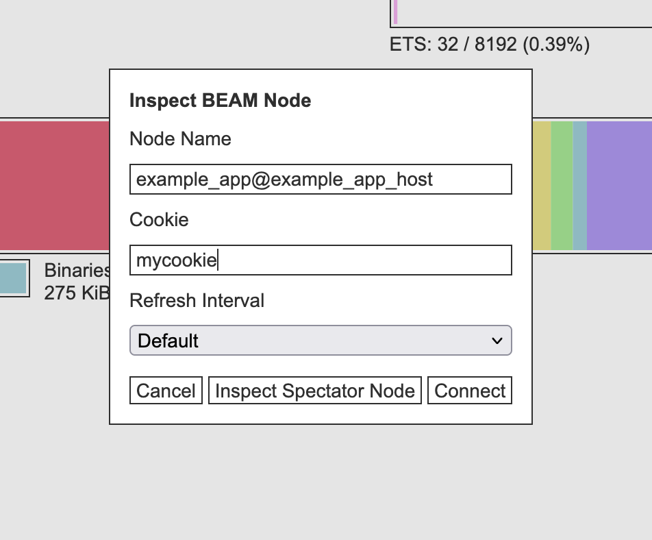

# Example

This is an example of how to use spectator to inspect a running Gleam app with docker.

The code of the example app is from the lustre example [server-components/publish-subscribe](https://github.com/lustre-labs/lustre/tree/main/examples/06-server-components/05-publish-subscribe).

The Dockerfile for the example app is the standard template from https://gleam.run/deployment/linux-server/#create-a-dockerfile.

We can start the app along with spectator on the same docker network using docker compose:

```yaml
# Note: be careful with publishing ports via docker, as this will
# expose the ports to the whole network unless bound to localhost.

services:
  app:
    build:
      context: .
      dockerfile: Dockerfile
    environment:
      ERL_FLAGS: "-sname example_app -setcookie mycookie"
    hostname: example_app_host
    ports:
      - "127.0.0.1:1234:1234"

  spectator:
    image: ghcr.io/jonasgruenwald/spectator:v2.0.0-test
    ports:
      - "127.0.0.1:3000:3000"
```

```sh
docker compose up
```

The logs for the container should show both apps as running:

```txt
spectator-1  | 🔍 Spectator is listening on http://0.0.0.0:3000 - Node: spectator_app@0f07ed8866ca
app-1        | Listening on http://127.0.0.1:1234
```

Then you can open spectator at http://127.0.0.1:3000, click "Change Target" and input the details of the app to inspect like so:



Or just connect directly using the URL: http://127.0.0.1:3000/dashboard?node=example_app%40example_app_host&cookie=mycookie

